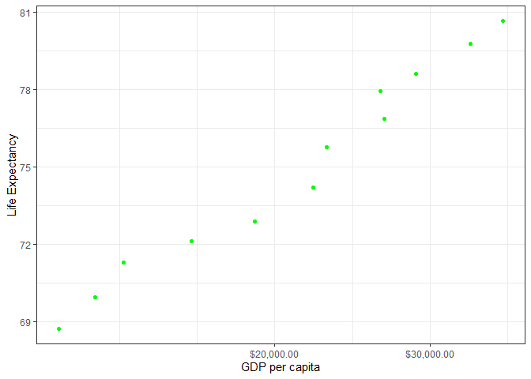
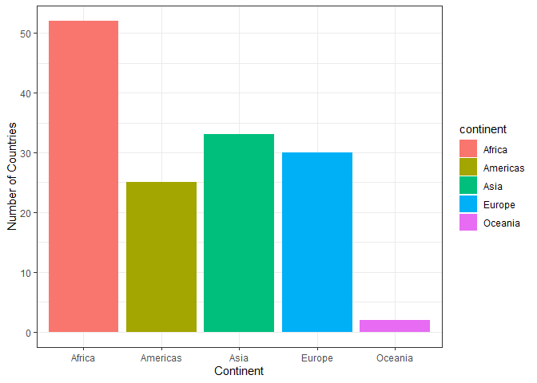
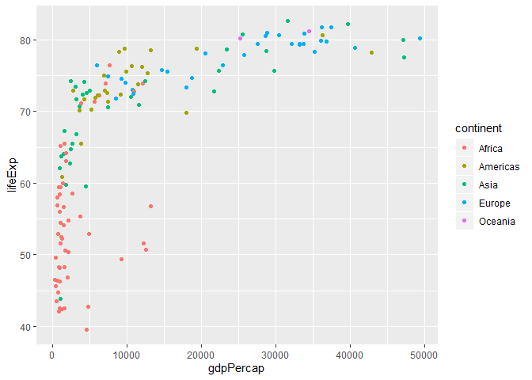

<!--- allow for errors while knitting-->


<!--- load packages needed for the assignment ---> 


 
# Exercise 1: Basic dplyr 

## 1.1 subsetting gapminder to three countries in the 1970s

```r
gapminder %>% 
  filter(year > 1969 & year < 1980, 
        country == "Afghanistan" |
        country == "Canada" | 
        country == "Denmark")
```

```
## # A tibble: 6 x 6
##   country     continent  year lifeExp      pop gdpPercap
##   <fct>       <fct>     <int>   <dbl>    <int>     <dbl>
## 1 Afghanistan Asia       1972    36.1 13079460      740.
## 2 Afghanistan Asia       1977    38.4 14880372      786.
## 3 Canada      Americas   1972    72.9 22284500    18971.
## 4 Canada      Americas   1977    74.2 23796400    22091.
## 5 Denmark     Europe     1972    73.5  4991596    18866.
## 6 Denmark     Europe     1977    74.7  5088419    20423.
```
## 1.2 using a pipe operator to select country & gdpPercap from filtered dataset
GDP per capita in the 1970s 

Check that this works add select year?
 

```r
gapminder %>% 
  filter(year > 1969 & year < 1980, 
        country == "Afghanistan" |
        country == "Canada" | 
        country == "Denmark") %>% 
  select(country, gdpPercap)
```

```
## # A tibble: 6 x 2
##   country     gdpPercap
##   <fct>           <dbl>
## 1 Afghanistan      740.
## 2 Afghanistan      786.
## 3 Canada         18971.
## 4 Canada         22091.
## 5 Denmark        18866.
## 6 Denmark        20423.
```

## 1.3 filtering gapminder to all entries that have experienced a drop in life expectancy


```r
gapminder %>%
  arrange(year) %>% 
  select(country, year, lifeExp) %>% 
  group_by(country) %>% 
  mutate(diff_LifeExp = lifeExp - lag(lifeExp)) %>% 
  filter(diff_LifeExp < 0)
```

```
## # A tibble: 102 x 4
## # Groups:   country [52]
##    country          year lifeExp diff_LifeExp
##    <fct>           <int>   <dbl>        <dbl>
##  1 China            1962    44.5      -6.05  
##  2 Cambodia         1972    40.3      -5.10  
##  3 Czech Republic   1972    70.3      -0.0900
##  4 Netherlands      1972    73.8      -0.0700
##  5 Slovak Republic  1972    70.4      -0.63  
##  6 Bulgaria         1977    70.8      -0.09  
##  7 Cambodia         1977    31.2      -9.10  
##  8 El Salvador      1977    56.7      -1.51  
##  9 Poland           1977    70.7      -0.180 
## 10 Uganda           1977    50.4      -0.666 
## # ... with 92 more rows
```


## 1.4 showing max GDP per capita experienced by each country 

```r
gapminder %>% 
  group_by(country) %>% 
  summarise(max_gdpPercap = max(gdpPercap)) 
```

```
## # A tibble: 142 x 2
##    country     max_gdpPercap
##    <fct>               <dbl>
##  1 Afghanistan          978.
##  2 Albania             5937.
##  3 Algeria             6223.
##  4 Angola              5523.
##  5 Argentina          12779.
##  6 Australia          34435.
##  7 Austria            36126.
##  8 Bahrain            29796.
##  9 Bangladesh          1391.
## 10 Belgium            33693.
## # ... with 132 more rows
```

## 1.5 producing a scatterplot of Canada's life expectancy vs GDP 
Ensure log scale
Pipe directly into ggplot after altering dataset


```r
gapminder %>% 
  filter(country == "Canada") %>% 
  ggplot(aes(gdpPercap, lifeExp)) +
  geom_point(color = "green") +
  scale_x_log10("GDP per capita", labels = scales::dollar_format()) +
  theme_bw() +
  ylab("Life Expectancy")
```

<!-- -->


# Exercise 2: Explore individual variables with dplyr

**Choose one categorial and one quantitative variable:**
Categorical variable: continent
Quantative variable: gdpPercap

## What are the possible values of each variable?

**Continent:** 

How many continents are in the dataset?

```r
gapminder %>% 
  select(continent) %>% 
  summarize(n_unique = n_distinct(continent))
```

```
## # A tibble: 1 x 1
##   n_unique
##      <int>
## 1        5
```

What continents are included in the dataset?

```r
gapminder %>% 
  group_by(continent) %>% 
  summarize(n_unique = n_distinct(continent))
```

```
## # A tibble: 5 x 2
##   continent n_unique
##   <fct>        <int>
## 1 Africa           1
## 2 Americas         1
## 3 Asia             1
## 4 Europe           1
## 5 Oceania          1
```

How many countries are in each continent?


```r
gapminder %>% 
  select(continent, country) %>% 
  group_by(continent) %>% 
  summarize(n_unique = n_distinct(country))
```

```
## # A tibble: 5 x 2
##   continent n_unique
##   <fct>        <int>
## 1 Africa          52
## 2 Americas        25
## 3 Asia            33
## 4 Europe          30
## 5 Oceania          2
```

Can I visualize this in a graph?
Note: divide by 12 because there are 12 time points per country


```r
ggplot(gapminder) + 
  geom_bar(aes(continent, ..count../12, fill=continent)) +
  xlab("Continent") +
  ylab("Number of Countries")
```

<!-- -->


**GDP per capita**

Let's get run summary to find the range, median and mean for GDP per capita

```r
gapminder %>% 
  select(gdpPercap) %>% 
  summary() 
```

```
##    gdpPercap       
##  Min.   :   241.2  
##  1st Qu.:  1202.1  
##  Median :  3531.8  
##  Mean   :  7215.3  
##  3rd Qu.:  9325.5  
##  Max.   :113523.1
```

Which country had the lowest GDP per capita and which country had the highest GDP per capita in this dataset?

```r
gapminder %>% 
  select(country, year, gdpPercap) %>% 
  filter(gdpPercap == min(gdpPercap) | gdpPercap == max(gdpPercap)) %>% 
    group_by(country) 
```

```
## # A tibble: 2 x 3
## # Groups:   country [2]
##   country           year gdpPercap
##   <fct>            <int>     <dbl>
## 1 Congo, Dem. Rep.  2002      241.
## 2 Kuwait            1957   113523.
```
The Democratic Republic of Congo (in 2002) had the lowest GDP per capita. Kuwait (in 1957) had the highest GDP per capita.


If we wanted to, we could switch up the code a bit and see when each country had their lowest and highest GDP per capita. 
Note that for some countries lowest GDP per capita is quite recent

```r
gapminder %>% 
  select(country, year, gdpPercap) %>% 
  group_by(country) %>% 
  filter(gdpPercap == min(gdpPercap) | gdpPercap == max(gdpPercap)) %>% 
  arrange(country)
```

```
## # A tibble: 284 x 3
## # Groups:   country [142]
##    country      year gdpPercap
##    <fct>       <int>     <dbl>
##  1 Afghanistan  1982      978.
##  2 Afghanistan  1997      635.
##  3 Albania      1952     1601.
##  4 Albania      2007     5937.
##  5 Algeria      1952     2449.
##  6 Algeria      2007     6223.
##  7 Angola       1967     5523.
##  8 Angola       1997     2277.
##  9 Argentina    1952     5911.
## 10 Argentina    2007    12779.
## # ... with 274 more rows
```


# Exercise #3: Explore various plot types

##  life expectancies of continents over time?


```r
gapminder %>% 
  filter(year == 2007) %>% 
  ggplot(aes(gdpPercap,lifeExp)) +
  geom_point(aes(color=continent)) 
```

<!-- -->


## Another plot other than a scatterplot:
### life expectancy of in Canada vs Angola


```r
gapminder %>% 
  filter(country == "Canada" | country == "Angola") %>% 
  
  
```

```
## Error: <text>:6:0: unexpected end of input
## 4:   
## 5: 
##   ^
```

