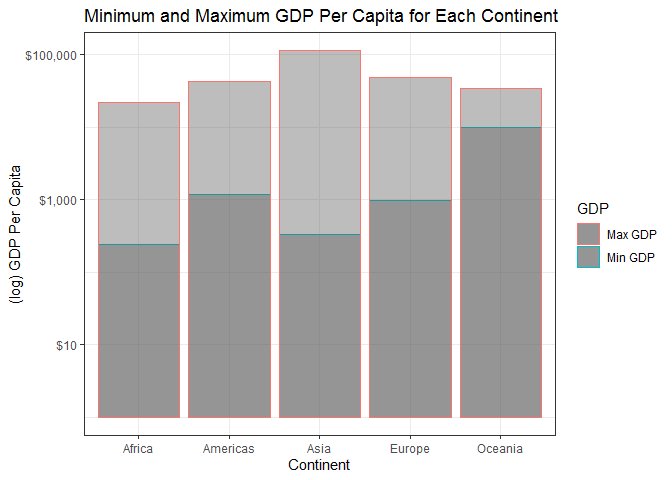
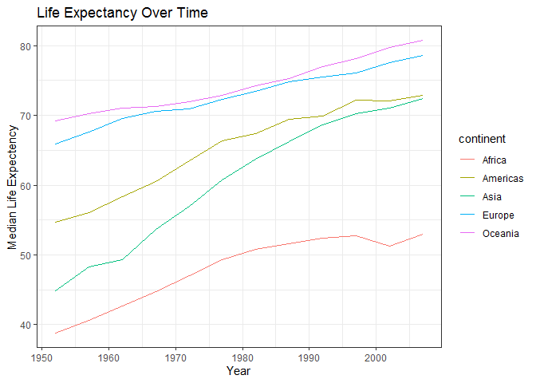
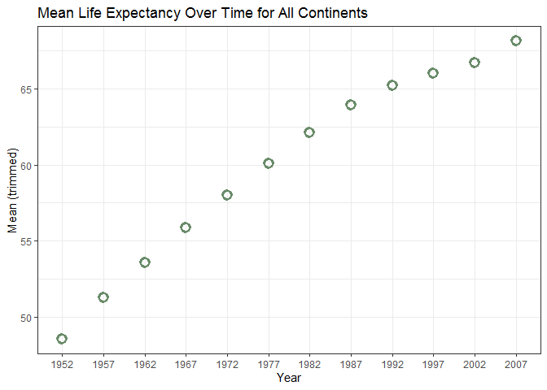

<!---The following chunk allows errors when knitting--->


<!-- load the required packages! --->

```r
library(gapminder)
library(tibble)
library(tidyverse)
library(ggplot2)
library(scales)
```

# Assignment #3 - Choose three coding options 

##  Task Option 2: Get the maximum and minimum GDP per capita for all continents

I chose this option because for a previous assignment I looked at the minimum and maximum GDP per capita overall. Now I'd like to figure out how to do it for each continent. 

<!---
So this code works, but it's not pretty... is there another way?

```r
gapminder %>% 
  select(continent, year, gdpPercap) %>% 
  group_by(continent) %>% 
  filter(gdpPercap == min(gdpPercap) | gdpPercap == max(gdpPercap))
```

```
## # A tibble: 10 x 3
## # Groups:   continent [5]
##    continent  year gdpPercap
##    <fct>     <int>     <dbl>
##  1 Oceania    1952    10040.
##  2 Oceania    2007    34435.
##  3 Europe     1952      974.
##  4 Africa     2002      241.
##  5 Americas   2007     1202.
##  6 Asia       1957   113523.
##  7 Africa     1977    21951.
##  8 Asia       1952      331 
##  9 Europe     2007    49357.
## 10 Americas   2007    42952.
```
--->

<!--- The summarize function makes more sense to use although it doesn't display the year for the min and max GDP, which would be interesting to know. 
Also don't need to select() in this iteration. --->

**First, I calculated the minimum and maximum GDP per capita using the summarize() function.**

```r
gapminder %>% 
  group_by(continent) %>% 
  summarize(min_GDP = min(gdpPercap), max_GDP = max(gdpPercap))
```

```
## # A tibble: 5 x 3
##   continent min_GDP max_GDP
##   <fct>       <dbl>   <dbl>
## 1 Africa       241.  21951.
## 2 Americas    1202.  42952.
## 3 Asia         331  113523.
## 4 Europe       974.  49357.
## 5 Oceania    10040.  34435.
```


**Second, I visualized the minimum and maximum GDP per capita in a stacked bar graph:**

<!--- Note to self: the alpha needs to be outside the aes() function or else it'll show up as a legend on the side.
https://stackoverflow.com/questions/11714951/remove-extra-legends-in-ggplot2 --->


<!--- https://stackoverflow.com/questions/33221794/separate-palettes-for-facets-in-ggplot-facet-grid/33222028#33222028 <-- It looks like it's difficult to get a good looking colour gradient. Maybe next time... --->

<!--- learned through accidentally keeping both the min and max geom_col coding lines that I can use that to plot both ---> 


```r
gapminder %>% 
  group_by(continent) %>% 
  summarize(min_GDP = min(gdpPercap), max_GDP = max(gdpPercap)) %>% 

ggplot(aes(colour=GDP)) +
  geom_col(aes(continent, min_GDP, colour = "Min GDP"), alpha = 0.4) +
  geom_col(aes(continent, max_GDP, colour = "Max GDP"), alpha = 0.4) +
  theme_bw() +
  scale_y_log10(labels = scales::dollar_format()) +
  labs(x="Continent", y="(log) GDP Per Capita") +
  ggtitle("Minimum and Maximum GDP Per Capita for Each Continent")
```

<!-- -->

The table and graph show that Asia and Africa have the biggest discrepnacy between minimum GDP and maximum GDP per capita. The smallest discrepency is in Oceania. 


# Task 5: How is life expectancy changing over time on different continents?

To examine this, I am looking at the median life expectancy.

**First, I used the group_by() and summarize() functions to look at life expectancy over time for each continent**

```r
gapminder %>% 
  group_by(continent, year) %>% 
  summarize(lifeExp = median(lifeExp)) %>% 
  DT::datatable()
```

<!--html_preserve--><div id="htmlwidget-427a2b41edf4076acc67" style="width:100%;height:auto;" class="datatables html-widget"></div>
<script type="application/json" data-for="htmlwidget-427a2b41edf4076acc67">{"x":{"filter":"none","data":[["1","2","3","4","5","6","7","8","9","10","11","12","13","14","15","16","17","18","19","20","21","22","23","24","25","26","27","28","29","30","31","32","33","34","35","36","37","38","39","40","41","42","43","44","45","46","47","48","49","50","51","52","53","54","55","56","57","58","59","60"],["Africa","Africa","Africa","Africa","Africa","Africa","Africa","Africa","Africa","Africa","Africa","Africa","Americas","Americas","Americas","Americas","Americas","Americas","Americas","Americas","Americas","Americas","Americas","Americas","Asia","Asia","Asia","Asia","Asia","Asia","Asia","Asia","Asia","Asia","Asia","Asia","Europe","Europe","Europe","Europe","Europe","Europe","Europe","Europe","Europe","Europe","Europe","Europe","Oceania","Oceania","Oceania","Oceania","Oceania","Oceania","Oceania","Oceania","Oceania","Oceania","Oceania","Oceania"],[1952,1957,1962,1967,1972,1977,1982,1987,1992,1997,2002,2007,1952,1957,1962,1967,1972,1977,1982,1987,1992,1997,2002,2007,1952,1957,1962,1967,1972,1977,1982,1987,1992,1997,2002,2007,1952,1957,1962,1967,1972,1977,1982,1987,1992,1997,2002,2007,1952,1957,1962,1967,1972,1977,1982,1987,1992,1997,2002,2007],[38.833,40.5925,42.6305,44.6985,47.0315,49.2725,50.756,51.6395,52.429,52.759,51.2355,52.9265,54.745,56.074,58.299,60.523,63.441,66.353,67.405,69.498,69.862,72.146,72.047,72.899,44.869,48.284,49.325,53.655,56.95,60.765,63.739,66.295,68.69,70.265,71.028,72.396,65.9,67.65,69.525,70.61,70.885,72.335,73.49,74.815,75.451,76.116,77.5365,78.6085,69.255,70.295,71.085,71.31,71.91,72.855,74.29,75.32,76.945,78.19,79.74,80.7195]],"container":"<table class=\"display\">\n  <thead>\n    <tr>\n      <th> <\/th>\n      <th>continent<\/th>\n      <th>year<\/th>\n      <th>lifeExp<\/th>\n    <\/tr>\n  <\/thead>\n<\/table>","options":{"columnDefs":[{"className":"dt-right","targets":[2,3]},{"orderable":false,"targets":0}],"order":[],"autoWidth":false,"orderClasses":false}},"evals":[],"jsHooks":[]}</script><!--/html_preserve-->

**Second, I visusalized the median life expectancy over time for each continent using a line graph**
<!--- for future reference on how to put labels at the end of plot points:
https://stackoverflow.com/questions/29357612/plot-labels-at-ends-of-lines ---> 


```r
gapminder %>% 
  group_by(year, continent) %>% 
  summarize(lifeExp = median(lifeExp)) %>% 
  ggplot(aes(x=year, y=lifeExp, colour=continent)) +
  geom_line() +
  theme_bw() +
#  geom_dl(aes(label = continent), method = list(dl.trans(x = x + .2), "last.points")) + couldn't figure out how to get the labels within the graph confines
#  facet_wrap(~ continent, scales = "free_y") + liked it better all on one graph for comparison
#  theme(legend.position = "none") +
  labs(x="Year", y ="Median Life Expectency") +
  ggtitle("Life Expectancy Over Time")
```

<!-- -->

The table and graph show that life expectancy in Africa has lagged compared to the 4 other continents. Oceania has consistency had the highest life expectancy, followed by Europe. Life expectency in all contients has risen, however Africa saw a leveling out and then decline in the 1990s and early 2000s.


# Task 4: Compute a trimmed mean of life expectancy for different years 
<!--- https://www.rdocumentation.org/packages/DescTools/versions/0.99.19/topics/Trim how to use trim() function ---> 

**First, I calculated trimmed means across all continents for each year using trim in the summarize and mean() functions.**

```r
gapminder %>% 
  group_by(year) %>% 
  summarize(trim_LifeExp = mean(lifeExp, trim = 0.10)) 
```

```
## # A tibble: 12 x 2
##     year trim_LifeExp
##    <int>        <dbl>
##  1  1952         48.6
##  2  1957         51.3
##  3  1962         53.6
##  4  1967         55.9
##  5  1972         58.0
##  6  1977         60.1
##  7  1982         62.1
##  8  1987         63.9
##  9  1992         65.2
## 10  1997         66.0
## 11  2002         66.7
## 12  2007         68.1
```

```r
# summarize(trim_LifeExp = mean(lifeExp, trim =3)) can also trim a specific number from each end.
```


**Second, I plotted the the trimmed means for all continents by year.**


```r
gapminder %>% 
  group_by(year) %>% 
  summarize(trim_LifeExp = mean(lifeExp, trim = 0.10)) %>% 

  ggplot(aes(x=factor(year), y=trim_LifeExp)) +
  geom_point(colour = "darkseagreen4", size = 3, shape = 21, stroke = 2) +
  labs(x = "Year", y = "Mean (trimmed)") +
  theme(legend.position = "none") +
  theme_bw() +
  ggtitle("Mean Life Expectancy Over Time for All Continents")
```

<!-- -->
<!---
Plotting trimmed means by year - alternative: 
I came across an alternative on the old STAT 545 message board. https://github.com/STAT545-UBC/Discussion/issues/132 & https://ggplot2.tidyverse.org/reference/stat_summary.html and decided this may be a tidier way to display the data --->

Life expectancy has been steadily rising across all continents since 1952, although it has levelled off somewhat starting in the 1990s. 


